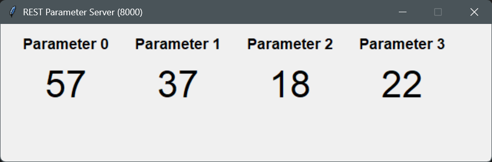

# Blackstar Amplification JUCE Test Template

When your interview begins, you will be given a task to complete.
This minimal JUCE environment allows you to get started with
a simple JUCE GUI app (created with JuMake). All you need is:

1. A CMake build environment
1. A C++ compiler that CMake supports (Visual Studio, CLang, GCC...)
1. A Python interpreter

Please clone this repository and check that you are able to build and
run both the app and the Python script ahead of the interview.

This template was tested on MacOS and Windows, but it should also work
on Linux. Please be in touch with any technical issues ahead of the
interview.

## Clone the repository

Please clone the repository and all its submodules with the tool that
you prefer. E.g. command-line git:

```bash
git clone --recursive https://github.com/BlackstarDigitalTeam/JUCERecruitmentTest.git
```

## Build the template app

```bash
cd JUCERecruitmentTest
cmake -B build .
cmake --build build --config Debug
```

The executable will be in different places depending on your compiler/OS combo.

Windows: `build\src\JUCERecruitmentTest_artefacts\Debug\JUCERecruitmentTest.exe`

MacOS: ``

## Run the server emulator script

```bash
python ./rest_server.py
```

You should see an image like the one below, representing the script's GUI:

